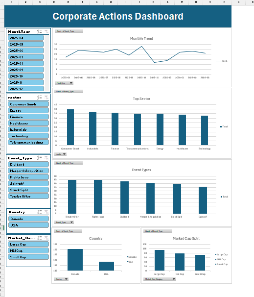
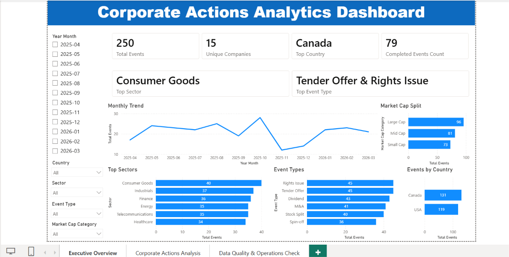
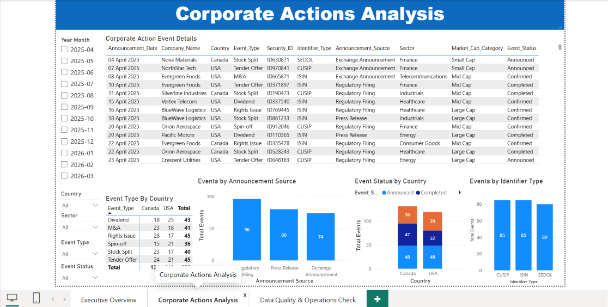
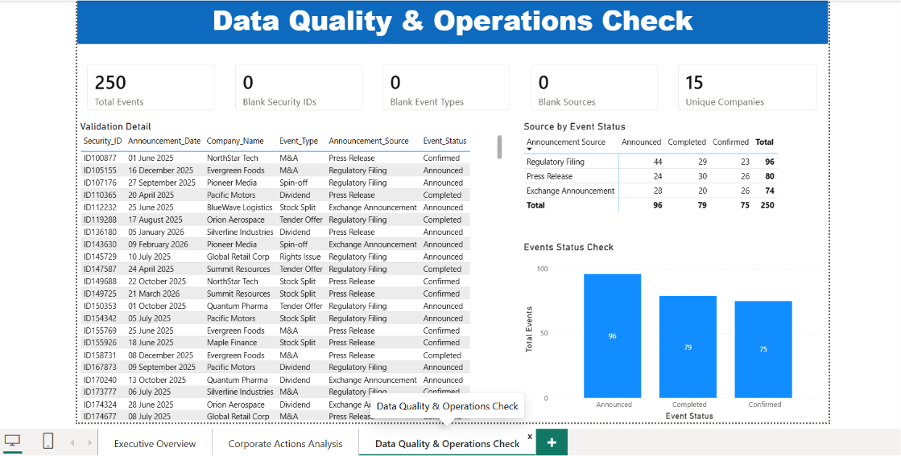
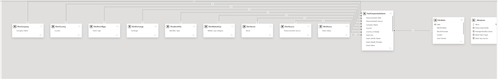
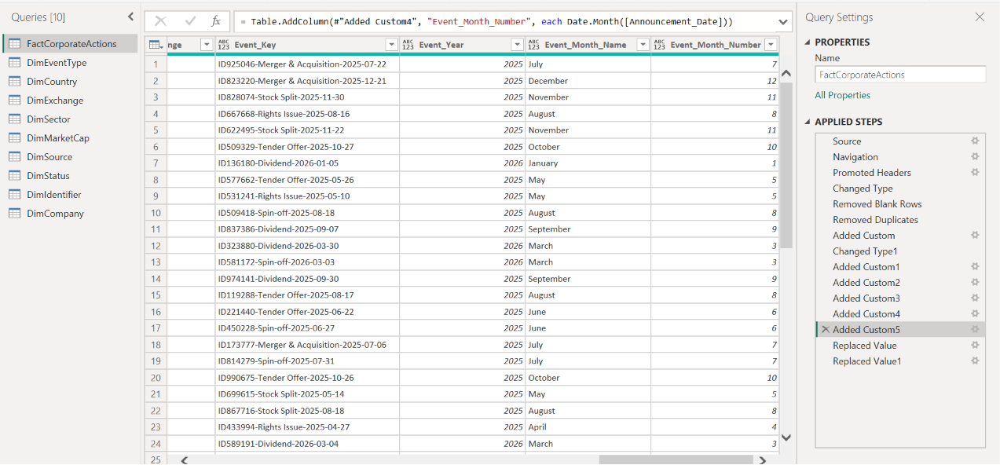

# Corporate Actions & Reference Data Analytics Dashboard

This project analyzes corporate action and reference data events using SQL, Excel, Power Query, and Power BI. It includes SQL analysis, data transformation, Excel dashboards, and an interactive Power BI dashboard to simulate reference data and capital markets operations workflows.

---

## Project Overview

This project covers:

- Corporate Actions & Reference Data Analysis
- SQL data analysis
- SQL Views
- Excel KPI Dashboard
- SQL Dashboard
- Interactive Power BI Dashboard
- Data cleaning and transformation using Power Query
- Data modeling
- Reference data validation
- Data quality checks

---

## Tools Used

| Tool | Purpose |
|------|---------|
| MySQL Workbench | SQL Queries & Views |
| Microsoft Excel | KPI Dashboard |
| Power BI | Interactive Dashboard |
| Power Query | Data Cleaning & Transformation |
| GitHub | Project Documentation |

---

## Dataset

The dataset contains **250 corporate action events** across **U.S. and Canadian markets**, including:

- Company Name
- Country
- Sector
- Event Type
- Announcement Date
- Market Cap Category
- Announcement Source
- Event Status

---

## SQL Analysis

SQL was used to:

- Company analysis
- Country analysis
- Sector analysis
- Event type analysis
- Create SQL Views
- Perform aggregations
- Reference data validation
- Data quality checks

The SQL file is available in:

```
corporate_actions_queries.sql
```

---

## Power BI Dashboard

The Power BI report contains **3 interactive pages**.

### Executive Overview

Features:

- Total Events
- Unique Companies
- Top Country
- Top Sector
- Top Event Type
- Monthly Trend
- Market Cap Distribution
- Interactive Filters

---

### Corporate Actions Analysis

Includes:

- Event Details
- Event Type by Country
- Announcement Source Analysis
- Event Status Analysis
- Identifier Type Analysis

---

### Data Quality & Operations Check

Includes:

- Blank Security IDs
- Blank Event Types
- Blank Sources
- Validation Table
- Status Summary

---

## Power BI Features Used

- Power Query
- Data Model
- Relationships
- DAX Measures
- Cards
- Tables
- Matrix
- Bar Charts
- Line Chart
- Slicers

---

## Key Insights

- Analyzed **250 corporate action events** across **U.S. and Canadian markets**.
- **15 unique companies** were analyzed.
- Canada recorded the highest number of corporate action events.
- Consumer Goods was the top sector.
- Tender Offers and Rights Issues were the most common corporate action event types.
- Performed reference data validation and data quality checks using dashboard metrics.

---

## Repository Structure

```
corporate-actions-reference-data-analytics/

│── README.md
│── LICENSE
│── corporate_actions_queries.sql
│── Corporate Actions KPI Dashboard.xlsx
│── Corporate_Actions_SQL_Dashboard.xlsx

└── screenshots/
    ├── excel_dashboard.png
    ├── sql_dashboard.png
    ├── powerbi_executive_overview.png
    ├── powerbi_analysis.png
    ├── powerbi_data_quality.png
    ├── power_query.png
    └── data_model.png
```

---

## Screenshots

### Excel Dashboard


---

### SQL Dashboard



---

### Power BI Executive Overview



---

### Power BI Corporate Actions Analysis



---

### Power BI Data Quality Dashboard



---

### Power Query Transformations



---

### Data Model



---

## Learning Outcomes

Through this project, I learned:

- SQL query development
- SQL Views
- Data cleaning and transformation
- Reference data validation
- Excel KPI dashboard development
- Power BI dashboard development
- Power Query transformations
- Data modeling
- DAX measures
- GitHub project documentation

---

## Author

**Jyothi Priya Garnepelli**

[LinkedIn](https://www.linkedin.com/in/jyothi-priya-garnepelli)

[GitHub](https://github.com/jyothigarnepelli23)
